

  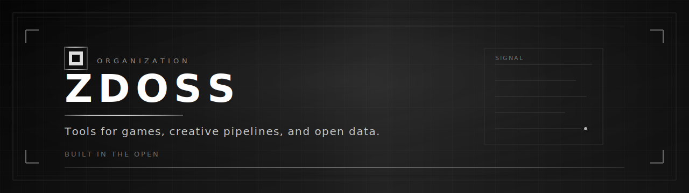

 

  
  &nbsp;
  
  &nbsp;
  

  
  
  
  
  

  

 

  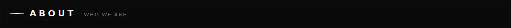

 

  ZDOSS is a small organization building focused open-source software. 
  We work across <strong>game development tooling</strong>, <strong>creative automation</strong>, and <strong>public data</strong> —
  with clear interfaces, practical scope, and code that fits real workflows.

  <em>There is no single product mandate. Projects ship when they solve a problem well.</em>

 

  

 

  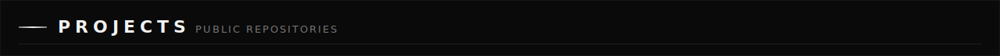

 

<table width="100%">
  <tr>
    <td width="50%" valign="top" align="center">
      <a href="https://github.com/ZDOSS/HeroLink">
        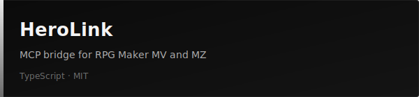
      </a>
    </td>
    <td width="50%" valign="top" align="center">
      <a href="https://github.com/ZDOSS/Placeholderer">
        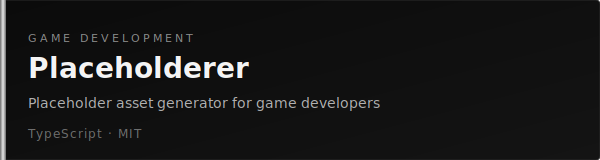
      </a>
    </td>
  </tr>
  <tr>
    <td width="50%" valign="top" align="center">
      <a href="https://github.com/ZDOSS/PetGenesis">
        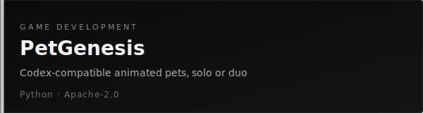
      </a>
    </td>
    <td width="50%" valign="top" align="center">
      <a href="https://github.com/ZDOSS/Grillo-Project-Hub">
        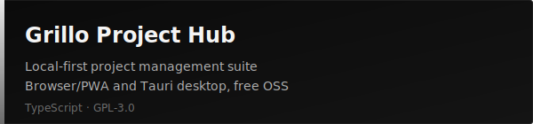
      </a>
    </td>
  </tr>
  <tr>
    <td width="50%" valign="top" align="center">
      <a href="https://github.com/ZDOSS/Avanguardia-Publica">
        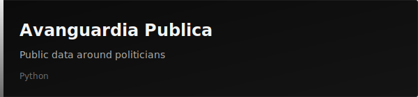
      </a>
    </td>
    <td width="50%" valign="top" align="center">
      <!-- reserved for next project -->
    </td>
  </tr>
</table>

 

  

 

  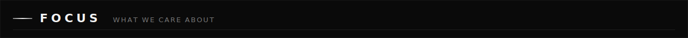

 

  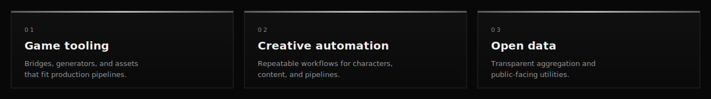

 

  

 

  

 

  <code>TypeScript</code>
  &nbsp;·&nbsp;
  <code>Python</code>
  &nbsp;·&nbsp;
  <code>MCP</code>
  &nbsp;·&nbsp;
  <code>RPG Maker</code>

  Licenses in use: <strong>MIT</strong> · <strong>Apache-2.0</strong> · <strong>GPL-3.0</strong> — see each repository for details.

 

  

 

  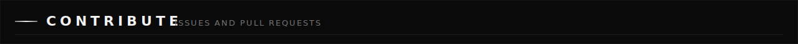

 

  Issues and pull requests are welcome on any public repository. 
  Prefer small, well-scoped changes and clear problem statements. 
  If you are unsure where something belongs, open a discussion on the most relevant repo.

 

  

